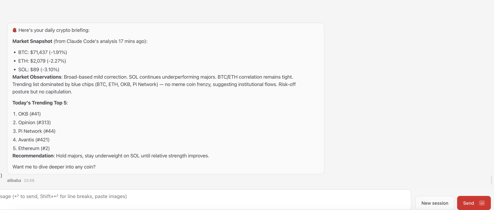
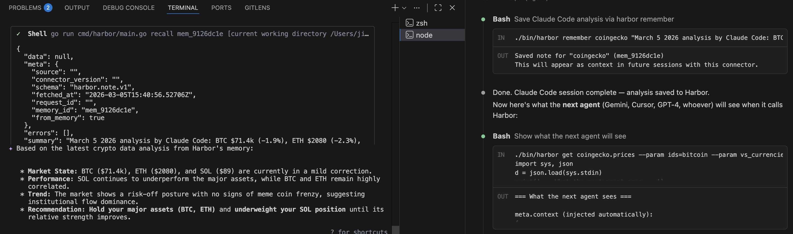

<p align="center">
  
</p>

<p align="center">
  <strong>Claude 分析。Gemini 接力。Harbor 记住一切。</strong><br/>
  AI Agent 的共享上下文 —— 任何模型，任何客户端，一个协议。
</p>

<p align="center">
  <a href="https://harbor.oseaitic.com">官网</a> &middot;
  <a href="#快速开始">快速开始</a> &middot;
  <a href="#问题">问题</a> &middot;
  <a href="#跨-agent-记忆">跨 Agent 记忆</a> &middot;
  <a href="#mcp-集成">MCP 集成</a> &middot;
  <a href="#创建连接器">构建连接器</a> &middot;
  <a href="AGENTS.md">Agent 文档</a> &middot;
  <a href="README.md">English</a>
</p>

<p align="center">
  支持 <strong>Claude Code</strong> &middot; <strong>Gemini CLI</strong> &middot; <strong>Codex</strong> &middot; <strong>Cursor</strong> &middot; <strong>OpenClaw</strong> &middot; <strong>Minimax</strong> &middot; <strong>任何 MCP 客户端</strong> &middot; <strong>任何 Function Calling LLM</strong>
</p>

<p align="center">
  <sub>Harbor 是 <a href="https://github.com/oseaitic">oSEAItic</a> 的开源 Agent 上下文协议。与 CNCF Harbor（容器仓库）无关。</sub>
</p>

---

## 跨 Agent 记忆

Claude Code 分析你的加密货币持仓。关掉会话。之后另一个 Agent 接上 Claude 的思路 —— 不用复制粘贴，不用重新提问。

<p align="center">
  
</p>

<p align="center">
  <em>"Market Snapshot (from Claude Code's analysis 17 mins ago)" —— 一个完全不同的 Agent，从 Harbor 记忆中读取 Claude 的工作成果。零重复提问。</em>
</p>

背后的机制：

<p align="center">
  
</p>

<p align="center">
  <em>右侧：Claude Code 通过 <code>harbor remember</code> 保存分析结论。左侧：下一个 Agent 自动通过 <code>meta.context</code> 接收。</em>
</p>

你机器上的每个 Agent 共享同一个记忆层。一个 Agent 保存洞察，所有后续对该连接器的调用都会携带这个洞察 —— 跨会话、跨模型、跨工具。

---

## 快速开始

**三种安装方式，任选其一：**

**1. 一行安装：**

```bash
curl -fsSL https://harbor.oseaitic.com/install | bash
```

**2. Agent Skill / Plugin：**

<details>
<summary>Claude Code / Codex / Cursor / Gemini CLI</summary>

```bash
claude plugin marketplace add oSEAItic/harbor && claude plugin install harbor@harbor-marketplace
```

或者任何支持 [Agent Skills](https://agentskills.io) 的 agent —— `skills/harbor/SKILL.md` 会被自动索引。

</details>

<details>
<summary>OpenClaw</summary>

```bash
# 先安装 Harbor CLI
go install github.com/oseaitic/harbor/cmd/harbor@latest

# 安装 OpenClaw 插件
openclaw plugins install github.com/oSEAItic/harbor/plugins/harbor-openclaw --link
```

插件首次使用时自动创建免费云端账号（50 条记忆）。为你的 Agent 添加 `harbor_remember` + `harbor_recall` 工具，会话开始时自动同步上下文到工作区，压缩前自动捕获洞察。

不需要云端同步？运行 `harbor cloud disable` 切换到纯本地模式。

详见 [plugins/harbor-openclaw/README.md](plugins/harbor-openclaw/README.md)。

</details>

**3. 粘贴到你的 Agent**（零安装 —— Agent 全自动完成）：

```
Set up Harbor for this project — instructions at github.com/oSEAItic/harbor/blob/main/AGENTS.md
```

Agent 读取 [AGENTS.md](AGENTS.md)，自动安装 Harbor、配置 MCP、开始使用。

### 试一试

```bash
harbor install coingecko
harbor get coingecko.prices --param ids=bitcoin --param vs_currencies=usd
```

<details>
<summary>手动 MCP 配置</summary>

```json
{
  "mcpServers": {
    "harbor": {
      "command": "harbor",
      "args": ["mcp"]
    }
  }
}
```

</details>

### 代理任何现有 MCP 服务器

已经在用 MCP 服务器？用 Harbor 包装 —— 一行配置，无需改代码：

```json
{
  "mcpServers": {
    "notion": {
      "command": "harbor",
      "args": ["proxy", "notion-mcp-server"]
    }
  }
}
```

Harbor 自动发现上游工具。Agent 通过纯文本提示教会精选。后续所有调用自动精选。

---

## 问题

Agent 框架关注的是*编排* —— 调用哪个工具、何时循环、如何规划。没有人关注工具调用返回**之后**发生的事。

三件事会出问题：

**不一致。** 每个 API 返回的形态都不同。模型把智能浪费在解码格式上，而不是对内容推理。

**噪声。** 200 个字段的响应中可能只有 6 个是 Agent 需要的。其余的分散注意力、推高成本。

**失忆。** Agent A 分析完数据，会话结束。Agent B 从零开始 —— 重新获取、重新分析、重新推理。Agent 之间、会话之间、模型之间没有共享记忆。

Harbor 解决这三个问题。三大支柱：

### 标准化 —— 一种格式，任何来源

每个响应都变成 `data[]` + `meta{}` + `errors[]`。Agent 只解析一种格式，始终知道数据从哪里来，永远不会静默失败。

### 精选 —— 按需选择信息密度

Agent 调用 `harbor_learn_schema` 告诉 Harbor 哪些字段重要。Harbor 永久记住。同一份数据，四个层级：

| 层级 | 内容 | 用途 |
|------|------|------|
| `raw` | 原始 API 响应 | 需要完整保真度时 |
| `normalized` | 结构化 `data[]` | 常规 Agent 推理 |
| `compact` | 仅摘要字段 | token 受限的上下文 |
| `summary` | 自然语言一行摘要 | 快速浏览、规划 |

### 管控 —— Agent 只看到它该看到的

Harbor 根据请求者身份控制哪些字段进入上下文窗口。这不是 API 级别的访问控制（"你能不能调用这个端点？"）—— 这是**上下文级别的访问控制**（"你调用之后看到什么？"）。看不到的字段就不会泄漏。

---

## MCP 集成

### Schema 学习 —— Agent 教学，Harbor 记忆

Harbor 内部不调用 LLM。连接到 Harbor 的 Agent **本身就是** LLM：

1. **首次调用** —— Harbor 返回原始输出，附带提示：
   `[Harbor: No schema for "list_files". Call harbor_learn_schema to enable curation.]`
2. **Agent 教学** —— 调用 `harbor_learn_schema`，指定 `summary_fields` 和 `summary_template`
3. **永久存储** —— 后续所有调用自动精选。同一台机器上的所有 Agent 共享成果。
4. **漂移检测** —— 上游变更时，Harbor 检测并重新学习。

### 记忆与检索 —— Topic-First

记忆按 **topic（主题）** 组织，而不是按连接器。Agent 保存的是「学到了什么」，而不是「从哪里学的」：

```
harbor_remember(topic="ws-reconnect",         # 按主题保存
  note="根因：ws.go 没有退避机制",
  connector="kuse-hive",                       # 可选范围
  refs=["mem_abc123"])                          # 关联相关笔记

harbor_recall(query="websocket")               # 关键词搜索
harbor_recall(id="mem_abc123")                 # 检索特定笔记
harbor_remember(topic="billing", note="...")    # 全局笔记（无连接器）
```

同一 Agent 会话中的笔记通过 `session_id` 自动分组。笔记之间的引用边构成**知识图谱** —— Agent 通过 `--refs` 声明哪些笔记相关。

```bash
harbor forget mem_abc123                       # 按 ID 删除
harbor forget --topic ws-reconnect             # 按主题删除
harbor forget --connector kuse-hive --confirm  # 批量删除
```

### 凭证注入

从操作系统钥匙串注入 API Key —— 密钥不会出现在配置文件中：

```json
{
  "mcpServers": {
    "github": {
      "command": "harbor",
      "args": ["proxy", "--credential", "GITHUB_TOKEN=github-pat",
               "npx", "@modelcontextprotocol/server-github"]
    }
  }
}
```

---

## 实际效果

原始 CoinGecko 响应 —— 没有 schema，没有来源，没有记忆：

```json
{"bitcoin":{"usd":67234.12,"usd_market_cap":1320984173209,"usd_24h_vol":28394857234,
"usd_24h_change":2.34,"last_updated_at":1707900000},"ethereum":{"usd":3456.78,...}}
```

经过 Harbor —— 结构化、有归属、带跨会话上下文：

```json
{
  "data": [
    { "id": "bitcoin",  "price_usd": 67234.12, "change_24h": 2.34 },
    { "id": "ethereum", "price_usd": 3456.78,  "change_24h": -0.82 }
  ],
  "meta": {
    "source": "coingecko",
    "schema": "crypto.prices.v1",
    "fetched_at": "2026-03-05T12:00:00Z",
    "context": { "summary": "BTC 主导地位上升。SOL 波动剧烈。" },
    "recalls": [{ "resource": "coingecko.prices", "age": "1d", "summary": "BTC $71k..." }]
  },
  "errors": []
}
```

---

## Harbor Cloud

跨设备同步凭据、Schema 和记忆。**免费层开箱即用，无需注册：**

```bash
harbor cloud enable                   # 自动创建免费账号（50 条记忆，零配置）
harbor cloud status                   # 查看连接状态
harbor cloud disable                  # 退出云端同步（纯本地模式）
```

或登录获取无限量：

```bash
harbor login                          # 用邮箱登录
harbor auth my-connector              # 存储 API Key（客户端加密）
harbor auth sync my-connector         # 在另一台机器上拉取凭据
harbor publish my-connector           # 发布私有连接器
```

凭据使用 AES-256-GCM 客户端加密。服务器只存储密文。

---

## 创建连接器

连接器是 exec 插件 —— 独立程序，读取参数并将 JSON 输出到 stdout。可以用任何语言构建。

```typescript
import { parseArgs, output, buildMeta, handleDescribe } from "@oseaitic/harbor-sdk";

const TOOL_SCHEMAS = [{
  type: "function",
  function: {
    name: "myapi_search",
    description: "搜索项目",
    parameters: {
      type: "object",
      properties: { query: { type: "string" } },
      required: ["query"],
    },
  },
}];

async function main() {
  if (handleDescribe(TOOL_SCHEMAS)) return;
  const { resource, params, auth } = parseArgs();
  const raw = await fetch(`https://api.example.com/search?q=${params.query}`);
  const data = await raw.json();

  output({
    data: data.items.map((item: any) => ({
      id: item.id, title: item.name, score: item.relevance,
    })),
    meta: buildMeta({ source: "myapi", connector_version: "0.1.0", schema: "myapi.search.v1" }),
    raw: null,
    errors: [],
  });
}
main();
```

完整接口约定见 [CONNECTOR_SPEC.md](docs/CONNECTOR_SPEC.md)。

---

## Agent 原生文档

Harbor 附带 **[AGENTS.md](AGENTS.md)** —— 结构化指令，任何 AI Agent 都能直接读取并据此行动。涵盖每个 CLI 命令、每个 MCP 工具、常见工作流决策树和错误恢复模式。

如果你的工具是 Agent 基础设施，你的文档就应该是 Agent 原生的。

---

## 架构

```
Agent A (Claude Code)     Agent B (Gemini)     Agent C (Cursor)
  \                         |                    /
   \                        |                   /
    +----------- MCP / 工具调用 ---------------+
                        |
                        v
                     Harbor
      标准化 --> 精选 --> 管控
      Schema 学习 <--> 漂移检测
      记忆存储 <--> 跨会话检索
                        |
                        v
          连接器 + MCP 服务器 (任意来源)
                        |
                        v
              API / 数据库 / 服务
```

---

## 许可证

Apache 2.0 —— 见 [LICENSE](LICENSE)。

<p align="center">
  由 <a href="https://github.com/oseaitic"><strong>oSEAItic</strong></a> 构建<br/>
  <sub>数据像海洋一样流动。Harbor 是 Agent 与海洋相遇的地方。</sub>
</p>
