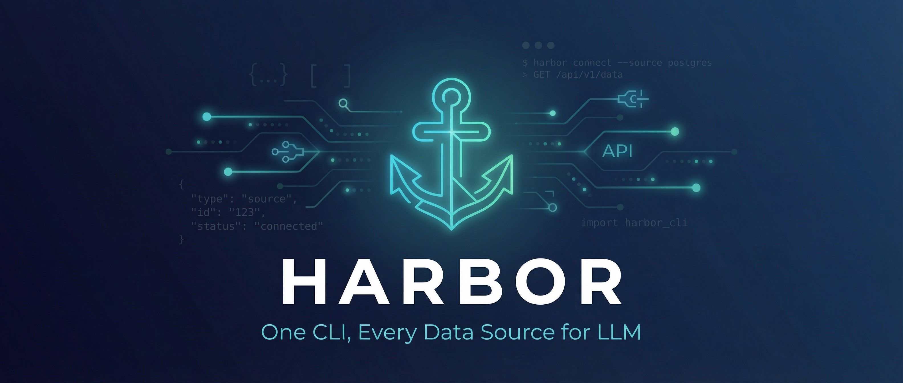

<p align="center">
  
</p>

<p align="center">
  <strong>One CLI, Every Data Source for LLM Agents.</strong><br/>
  Turn any external API into LLM-readable context with schema versioning, source provenance, and built-in tool discovery.
</p>

<p align="center">
  <a href="#install">Install</a> &middot;
  <a href="#quick-start">Quick Start</a> &middot;
  <a href="#why-context-engineering">Context Engineering</a> &middot;
  <a href="#creating-a-connector">Build a Connector</a> &middot;
  <a href="#architecture">Architecture</a> &middot;
  <a href="LICENSE">License</a> &middot;
  <a href="README.CN.md">中文</a>
</p>

---

## The Story

**oSEAItic** builds infrastructure for AI that reasons over real-world data.

It started with [Little RAG](https://github.com/oseaitic/little-rag) — a retrieval-augmented generation platform. The retrieval part worked. The augmentation part was the problem. Every time we connected a new data source — crypto prices, payment records, weather feeds, internal databases — the agent received a different shape of data. Different field names, different nesting, different error formats, no provenance, no schema version. The model had to waste context window just *figuring out what it was looking at* before it could reason about it.

We were doing context engineering by hand, writing bespoke adapters that translated each API's response into something an LLM could actually use. Multiply that across dozens of sources and the context engineering layer became bigger than the agent itself.

We asked ourselves: *what if every data source was already LLM-readable?*

That question became **Harbor**.

The name comes from what a harbor actually does — ships of every shape and origin dock at the same port. Cargo gets unloaded into a standard format, inventoried with provenance metadata, and dispatched. It doesn't matter whether the ship sailed from CoinGecko, Stripe, or a private database — once it's in the harbor, everything follows the same protocol. The agent never has to ask *"what am I looking at?"* — the schema, source, version, and timestamp are already there.

Harbor is a context engineering layer for AI agents. Every connector normalizes upstream data into a consistent JSON envelope that LLMs can parse without preamble. `harbor tools export` emits OpenAI-compatible function schemas so agents discover what data they can reach. The model doesn't just get data — it gets **structured, self-describing, provenance-tracked context** that maximizes the value of every token in the context window.

We built Harbor because the missing piece in agent infrastructure isn't better models — it's better context. We open-sourced it because everyone building agents needs this too.

**One CLI. Every data source. Context-engineered for agents.**

---

## Why Context Engineering?

LLMs are only as good as the context they receive. Most agent frameworks focus on *orchestration* — which tool to call, when to loop, how to plan. Harbor focuses on what happens **after** the tool call returns: the quality of the data that lands in the context window.

### The problem with raw API responses

```
// What CoinGecko returns
{"bitcoin":{"usd":67234.12}}

// What Stripe returns
{"data":[{"id":"txn_1abc","amount":4999,"currency":"usd","created":1707900000}]}
```

An agent receiving these has to:
1. Figure out the structure of each response (wasted reasoning tokens)
2. Guess field semantics with no schema reference
3. Handle errors differently per source
4. Track nothing about freshness, version, or provenance

### What Harbor gives the agent instead

```json
{
  "data": [
    { "id": "bitcoin", "price_usd": 67234.12, "market_cap_usd": 1320000000000 }
  ],
  "meta": {
    "source": "coingecko",
    "connector_version": "0.1.0",
    "schema": "crypto.prices.v1",
    "tool_schema_version": "harbor.tools.v1",
    "fetched_at": "2026-02-14T12:00:00Z",
    "request_id": "a1b2c3d4-..."
  },
  "raw": null,
  "errors": []
}
```

Every response is **self-describing**. The agent knows:
- **What source** produced this data (`meta.source`)
- **What schema** to expect (`meta.schema`) — so it can parse without guessing
- **When** it was fetched (`meta.fetched_at`) — staleness-aware reasoning
- **What version** of the connector ran (`meta.connector_version`) — reproducibility
- **Whether errors occurred** (`errors[]`) — no silent failures

This is context engineering at the protocol level. The agent spends zero tokens understanding the format and all tokens reasoning about the content.

### Tool discovery for agents

```bash
harbor tools export
```

Emits an array of OpenAI-compatible function schemas — one per resource, per connector. Drop it into any function-calling agent and the model instantly knows what data sources exist, what parameters they accept, and what they return. No manual tool definitions. No drift between docs and reality.

```json
[
  {
    "type": "function",
    "function": {
      "name": "coingecko_prices",
      "description": "Get current prices for cryptocurrencies",
      "parameters": {
        "type": "object",
        "properties": {
          "ids": { "type": "string", "description": "Comma-separated coin IDs" },
          "vs_currencies": { "type": "string", "description": "Target currencies" }
        },
        "required": ["ids", "vs_currencies"]
      }
    }
  }
]
```

---

## Install

```bash
# From source
go install github.com/oseaitic/harbor/cmd/harbor@latest

# Or build locally
make build
./bin/harbor version
```

## Quick Start

```bash
# Install a connector
harbor install coingecko

# Fetch data — normalized, schema-versioned, provenance-tracked
harbor get coingecko.prices --param ids=bitcoin --param vs_currencies=usd

# Export tool schemas — drop directly into your agent's function calling
harbor tools export

# Configure auth for premium connectors
harbor auth stripe

# Get the raw upstream response alongside normalized data
harbor raw coingecko.prices --param ids=bitcoin --param vs_currencies=usd

# List all installed + available connectors
harbor list

# Recall data from memory
harbor recall coingecko.prices --layer summary
harbor recall --list
harbor recall --search "bitcoin"
```

## MCP Proxy — Wrap Any MCP Server

Harbor can act as a transparent proxy in front of any existing MCP server (Notion, GitHub, filesystem, Slack, etc.). It re-discovers the upstream server's tools, automatically compresses output with learned schemas, and caches results to memory. The agent config change is one line:

```json
{
  "mcpServers": {
    "notion": {
      "command": "harbor",
      "args": ["proxy", "notion-mcp-server"]
    }
  }
}
```

No environment variables or API keys required. On first call, Harbor passes through raw output and prompts the agent to call `harbor_learn_schema` to teach compression. After that, all future calls are automatically compressed — permanently. Every agent on the machine benefits from schemas learned by any other agent.

```
Agent (Claude/Cursor)
  ↓ MCP stdio
Harbor Proxy (MCP Server)
  ├── schema check → compress if learned
  ├── memory check → return cached if fresh
  ├── harbor_learn_schema → agent teaches compression
  ├── harbor_recall → cross-session memory search
  ↓ MCP stdio (client)
Upstream MCP Server (any)
```

## MCP Server — Native MCP for Built-in Connectors

Harbor also exposes all installed connectors as native MCP tools:

```json
{
  "mcpServers": {
    "harbor": {
      "command": "harbor",
      "args": ["mcp"]
    }
  }
}
```

Tool calls run through Harbor's pipeline — execute, context-compile, and cache to 4-layer memory — so agents get compression and memory for free.

## Memory & Recall

Every `harbor get` and every proxied tool call is cached into a 4-layer memory system:

| Layer | Content | Use case |
|-------|---------|----------|
| `raw` | Original API / tool output | Full fidelity when needed |
| `normalized` | Connector's `data[]` array | Structured records |
| `compact` | Summary fields only | Token-efficient context |
| `summary` | Natural language one-liner | Quick scanning |

Recall data from memory via CLI or MCP tool:

```bash
# Browse recent memories
harbor recall --list

# Search by keyword
harbor recall --search "bitcoin"

# Retrieve a specific memory
harbor recall coingecko.prices --layer compact
```

Agents connected via MCP can call `harbor_recall` to search and retrieve memories across sessions.

### Agent integration (Python example)

```python
import subprocess, json

# Fetch context-engineered data for the agent
result = subprocess.run(
    ["harbor", "get", "coingecko.prices", "--param", "ids=bitcoin", "--param", "vs_currencies=usd"],
    capture_output=True, text=True
)
context = json.loads(result.stdout)

# Feed to LLM — the model receives structured, self-describing context
messages = [
    {"role": "system", "content": "You are a financial analyst. Use the provided data to answer questions."},
    {"role": "user", "content": f"Based on this data:\n{json.dumps(context, indent=2)}\n\nWhat is Bitcoin's current price?"}
]
```

### Agent integration (tool use)

```python
import subprocess, json

# Load Harbor tool schemas into your agent
tools_raw = subprocess.run(["harbor", "tools", "export"], capture_output=True, text=True)
tools = json.loads(tools_raw.stdout)

# Pass to OpenAI / Anthropic / any function-calling model
response = client.chat.completions.create(
    model="gpt-4",
    messages=messages,
    tools=tools,  # Harbor-generated, always in sync with installed connectors
)
```

## Output Format

Every connector returns the same envelope — designed for LLM consumption:

```json
{
  "data": [...],
  "meta": {
    "source": "coingecko",
    "connector_version": "0.1.0",
    "schema": "crypto.prices.v1",
    "tool_schema_version": "harbor.tools.v1",
    "fetched_at": "2026-02-14T12:00:00Z",
    "request_id": "a1b2c3d4-..."
  },
  "raw": null,
  "errors": []
}
```

| Field | Purpose for agents |
|-------|-------------------|
| `data` | Normalized, schema-conformant records — parse once, use everywhere |
| `meta.source` | Source attribution — the agent knows where data came from |
| `meta.schema` | Schema identifier — the agent knows what fields to expect |
| `meta.fetched_at` | Timestamp — enables staleness-aware reasoning |
| `meta.request_id` | Trace ID — debug and audit agent decisions end-to-end |
| `raw` | Optional upstream response — for when the agent needs full fidelity |
| `errors` | Structured errors with codes — no silent failures, no guessing |

## Creating a Connector

Connectors are exec plugins — standalone binaries that read arguments and write JSON to stdout. Build them in any language. Each connector transforms a raw API into LLM-ready context.

### TypeScript (using harbor-sdk)

```typescript
import { parseArgs, output, buildMeta, handleDescribe } from "harbor-sdk";

const TOOL_SCHEMAS = [
  {
    type: "function",
    function: {
      name: "myconnector_search",
      description: "Search for items",
      parameters: {
        type: "object",
        properties: {
          query: { type: "string", description: "Search query" },
        },
        required: ["query"],
      },
    },
  },
];

async function main() {
  // When an agent asks "what tools exist?", emit schemas
  if (handleDescribe(TOOL_SCHEMAS)) return;

  const { resource, params, auth } = parseArgs();

  // Fetch from upstream API
  const rawData = await fetchFromAPI(params, auth);

  // Context engineering: normalize into agent-friendly structure
  const normalized = rawData.items.map((item: any) => ({
    id: item.id,
    title: item.name,           // consistent field naming
    description: item.desc,     // agents expect "description", not "desc"
    score: item.relevance,      // semantic field names
  }));

  output({
    data: normalized,
    meta: buildMeta({
      source: "my-connector",
      connector_version: "0.1.0",
      schema: "mydata.search.v1",
    }),
    raw: null,
    errors: [],
  });
}

main();
```

### Python (using harbor-sdk)

```python
from harbor_sdk import parse_args, output, build_meta, handle_describe

TOOL_SCHEMAS = [
    {
        "type": "function",
        "function": {
            "name": "myconnector_search",
            "description": "Search for items",
            "parameters": {
                "type": "object",
                "properties": {
                    "query": {"type": "string", "description": "Search query"},
                },
                "required": ["query"],
            },
        },
    },
]

def main():
    if handle_describe(TOOL_SCHEMAS):
        return

    args = parse_args()
    raw_data = fetch_from_api(args["params"], args["auth"])

    # Context engineering: normalize for the agent
    normalized = [
        {"id": item["id"], "title": item["name"], "description": item["desc"]}
        for item in raw_data["items"]
    ]

    output({
        "data": normalized,
        "meta": build_meta("my-connector", "0.1.0", "mydata.search.v1"),
        "raw": None,
        "errors": [],
    })

main()
```

### Interface Contract

```
connector --resource <name> --params '<json>' [--raw] [--describe]
```

| Flag | Purpose |
|------|---------|
| `--resource` | Which resource to fetch |
| `--params` | JSON object of parameters |
| `--raw` | Include the raw upstream API response alongside normalized data |
| `--describe` | Emit tool schemas for agent discovery (`harbor tools export`) |

Auth is injected via the `HARBOR_AUTH` environment variable — connectors never manage credentials directly.

## Architecture

```
                        ┌─────────────────────────────────────────┐
                        │              AI Agent                    │
                        │  (Claude, GPT-4, local LLM, etc.)       │
                        └──────────┬──────────────────▲───────────┘
                                   │ function call    │ structured context
                        ┌──────────▼──────────────────┤───────────┐
                        │           Harbor CLI                     │
                        │                                          │
                        │  harbor get <connector>.<resource>       │
                        │  harbor tools export                     │
                        │  harbor auth <connector>                 │
                        └──┬────────────┬────────────┬────────────┘
                           │            │            │
              ┌────────────▼──┐  ┌──────▼─────┐  ┌──▼────────────┐
              │   coingecko   │  │   stripe   │  │  your-source  │
              │  (connector)  │  │ (connector)│  │  (connector)  │
              └───────┬───────┘  └──────┬─────┘  └──────┬────────┘
                      │                 │               │
              ┌───────▼───────┐  ┌──────▼─────┐  ┌─────▼─────────┐
              │  CoinGecko    │  │  Stripe    │  │  Any API /    │
              │  API          │  │  API       │  │  Database     │
              └───────────────┘  └────────────┘  └───────────────┘

Each connector:
  1. Receives args + auth from Harbor
  2. Fetches raw data from upstream
  3. Context-engineers it into normalized JSON envelope
  4. Returns self-describing, schema-versioned data to the agent
```

## Project Structure

```
harbor/
├── assets/              # Logo and brand assets
├── cmd/harbor/          # CLI entrypoint
├── internal/
│   ├── cli/             # Command implementations (get, recall, proxy, mcp, ...)
│   ├── protocol/        # Request/response types + validation
│   ├── connector/       # Plugin executor + tool schema export
│   ├── context/         # Context compiler (field filtering + NL summary)
│   ├── memory/          # 4-layer memory store (~/.harbor/memory/)
│   ├── recall/          # harbor_recall MCP tool (shared by mcp + proxy)
│   ├── schema/          # Learned compression schemas (~/.harbor/schemas/)
│   ├── pipeline/        # Execute → compile → memory pipeline
│   ├── proxy/           # Transparent MCP proxy (server + client)
│   ├── mcpserver/       # Native MCP server for built-in connectors
│   ├── auth/            # OS keychain abstraction
│   ├── registry/        # Connector install/list from registry
│   └── generator/       # Connector scaffolding generator
├── gateway/             # Optional REST server for hosted agents
├── sdk/
│   ├── typescript/      # TypeScript connector SDK
│   └── python/          # Python connector SDK
├── schemas/             # Canonical JSON Schemas
├── connectors/
│   ├── coingecko/       # Reference connector (crypto)
│   └── yahoo/           # Reference connector (finance)
├── docs/                # Connector spec (agent-readable)
├── Makefile
└── LICENSE              # Apache 2.0
```

## Gateway

The optional gateway exposes Harbor's protocol over HTTP — for hosted agents, web apps, and multi-tenant environments where agents call data sources via API rather than CLI.

```bash
make gateway
PORT=8080 ./bin/harbor-gateway
```

```bash
curl -X POST http://localhost:8080/run \
  -H "Content-Type: application/json" \
  -d '{"connector":"coingecko","resource":"prices","params":{"ids":"bitcoin","vs_currencies":"usd"}}'
```

The response is identical to CLI output — same envelope, same context engineering, same agent-readiness.

## License

Apache 2.0 — see [LICENSE](LICENSE).

---

<p align="center">
  Built by <a href="https://github.com/oseaitic"><strong>oSEAItic</strong></a><br/>
  <sub>Context engineering infrastructure for AI agents.</sub>
</p>
